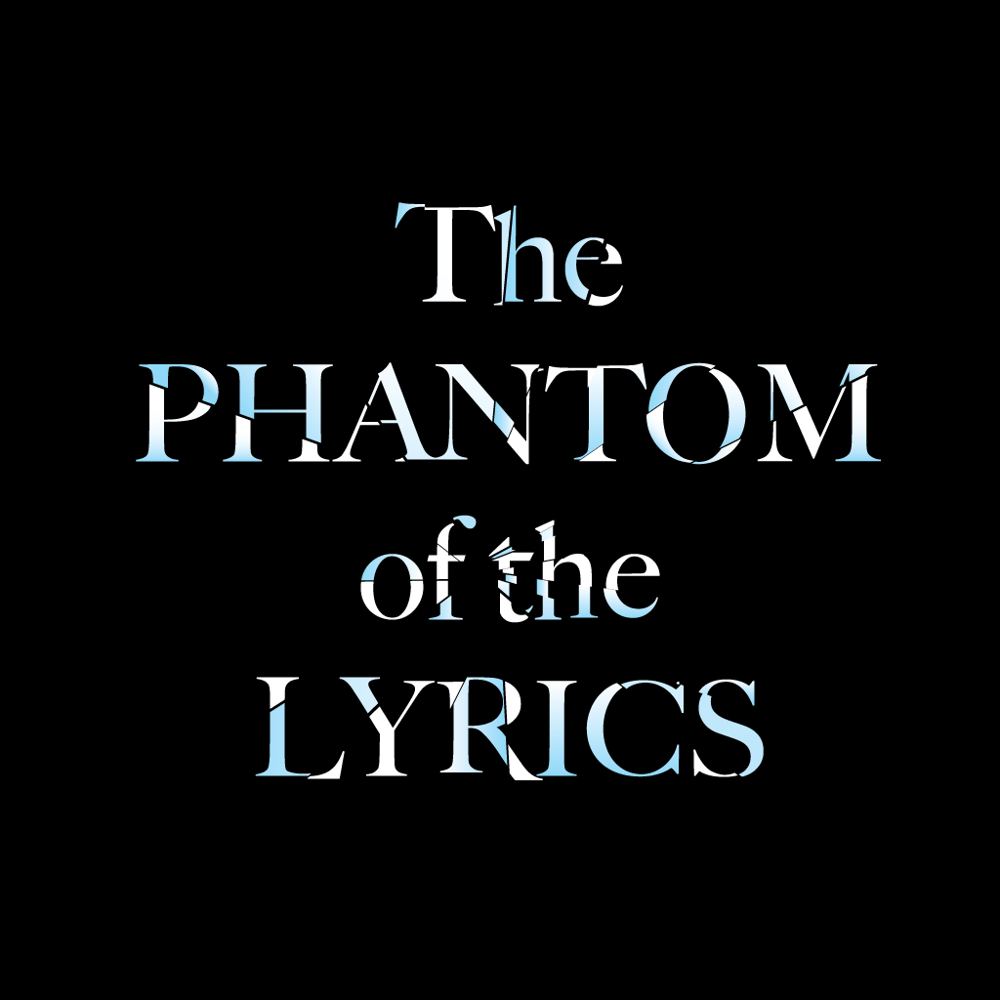
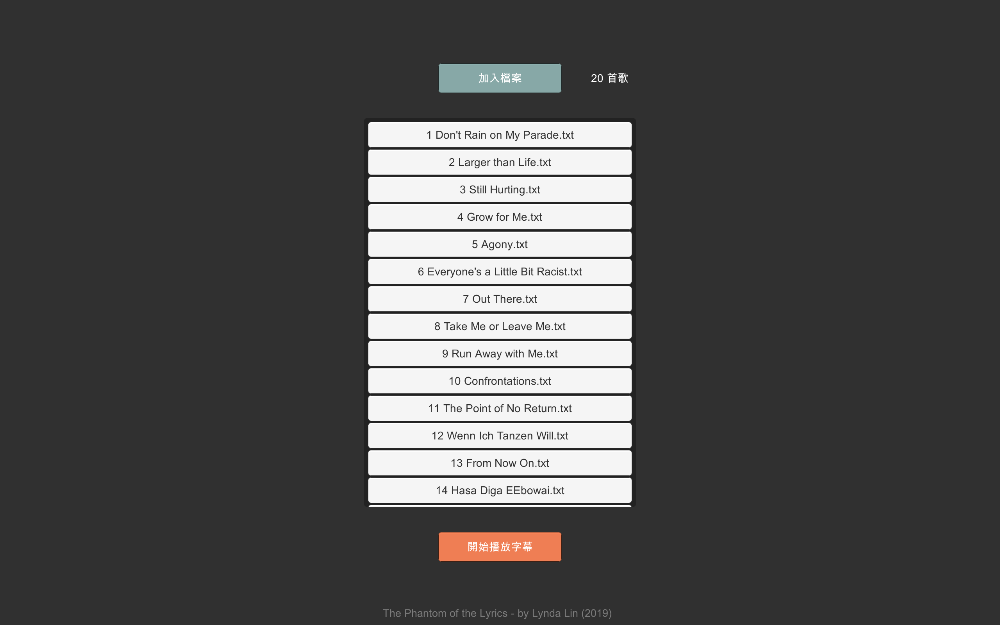
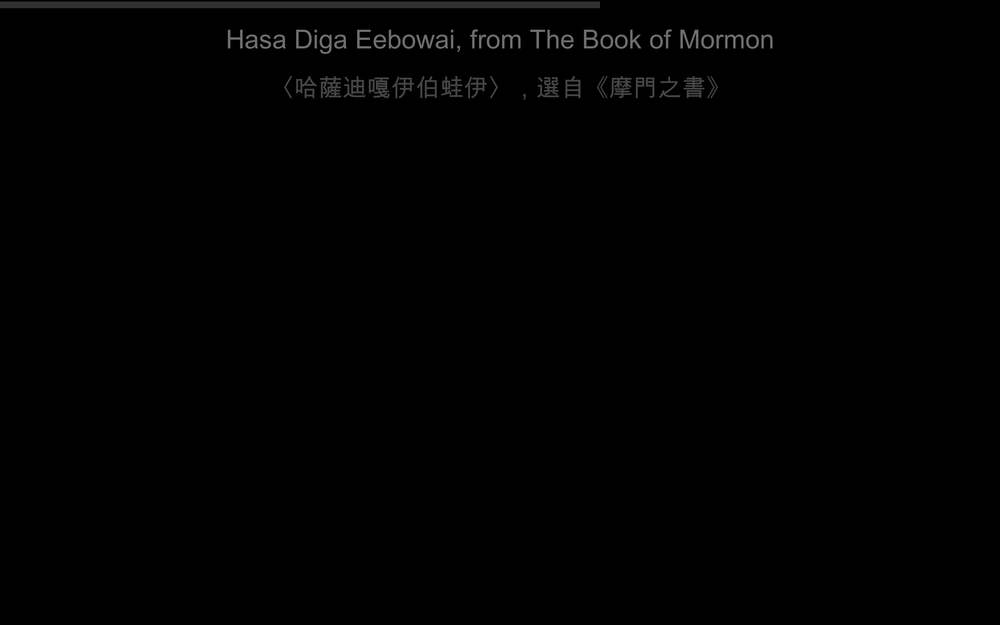
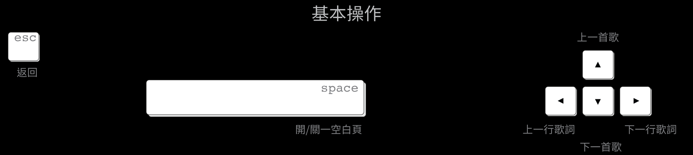

# lyricDisplayUnity aka. The Phantom of the Lyrics

此開源專案以Unity開發之桌面應用程式，網頁版[lyrics display](https://github.com/lynda0214/lyricDisplay/)為其前身，主要功能為輔助台大音樂劇社([Musical Club in National Taiwan University](https://www.facebook.com/ntumusical/))表演的字幕投影工具程式，亦歡迎任何其他有字幕投影需求之表演團體基於本專案進行延伸使用。

點擊下面圖片下載桌面應用程式 (Mac)

### 1. 介面

### 2. 基本操作

### 3. 歌詞檔的格式注意

a. 歌詞檔為純文字 .txt檔  
b. 每行會顯示為一頁  
c. 每行以斜線分隔英中歌詞 (ex. A whole new world/一個全新的世界)  
d. 單行只有 / 會顯示黑屏，間奏與結尾部分可多利用  
